# DeepAgents 组队学 · 任务1 环境准备 · 学习笔记

> 对应课程：[Deep Agents 实战](https://datawhalechina.github.io/deepagents-in-action/)  
> 范围：准备篇（上）AgentSeek 生命周期 + 准备篇（下）开发技能 / LangSmith Trace 自检  
> 环境：Windows 11 + WSL2 Ubuntu · 项目路径 `~/research_deepagent`（Linux 文件系统）  
> 日期：2026-09-10 ~ 2026-09-14  
> 说明：按任务表 **评审**（Python / Model API / Git / LangSmith 自检）与 **优秀作业**（清单、运行日志、问题排查）整理。密钥已打码。

---

## 1. 任务目标与完成标准对照

| 维度 | 任务表要求 | 本文对应 | 状态 |
|------|------------|----------|------|
| 评审 | Python 环境自检 | §3.1 | ✅ |
| 评审 | Model API 自检 | §3.2 | ✅（APINebula OpenAI 兼容） |
| 评审 | Git 环境自检 | §3.3 | ✅ |
| 评审 | LangSmith 自检 | §3.4 | ✅ |
| 优秀 | 完整自检清单 | §3 | ✅ |
| 优秀 | 运行日志 / 截图 | §4–§6 | ✅ |
| 优秀 | 问题排查过程写清楚 | §6 | ✅ |

额外完成：`agentseek create/sync/frontend/doctor/dev` 跑通；安装 `langchain-dev-guide`、`langsmith-trace`；完成一次慢调用 Trace 分析。

---

## 2. 环境架构说明（为何用 WSL2）

课程建议 Windows 优先 WSL2，且：

- 项目放在 Linux 家目录，不要长期放在 `/mnt/c/`
- 不要混用 Windows 与 WSL 的 Python / uv / Node / npm / Git

```ini
# /etc/wsl.conf
[interop]
appendWindowsPath = false
```

`wsl --shutdown` 后生效。本机发行版：

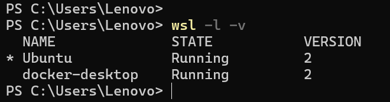

<p align="center"><strong>图1　WSL 发行版列表（Ubuntu / docker-desktop 均为 WSL2）</strong></p>

---

## 3. 环境自检清单（评审四项）

### 3.0 总览

| 检查项 | 结果摘要 |
|--------|----------|
| 系统 Python | 3.10.12（跟课以 uv 的 3.12 为准） |
| uv / 项目 Python | 0.12.12 / CPython 3.12.14 |
| agentseek | v0.1.4 |
| Git | 2.34.1 · `/usr/bin/git` |
| Model API | APINebula · `gpt-5.6-sol` |
| Tavily / LangSmith | Key 已配置；项目 `deepagents-course` |
| doctor | 全部 ok |

### 3.1 Python

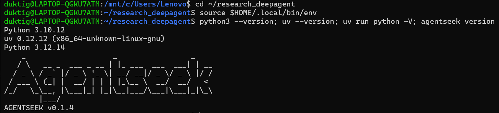

<p align="center"><strong>图2　Python / uv / agentseek 版本自检</strong></p>


- 系统自带 3.10；用 **uv** 在项目内拉取 3.12.14。
- uv 在 WSL 安装，未用 Windows PowerShell，避免混用。
- `agentseek task sync` 成功，含 `deepagents==0.7.13`。

### 3.2 Model API

```bash
AGENTSEEK_MODEL_PROVIDER=openai
AGENTSEEK_MODEL=gpt-5.6-sol
OPENAI_API_KEY=sk-***（已打码）
OPENAI_API_BASE=https://apinebula.ai/v1
TAVILY_API_KEY=tvly-***（已打码）
```

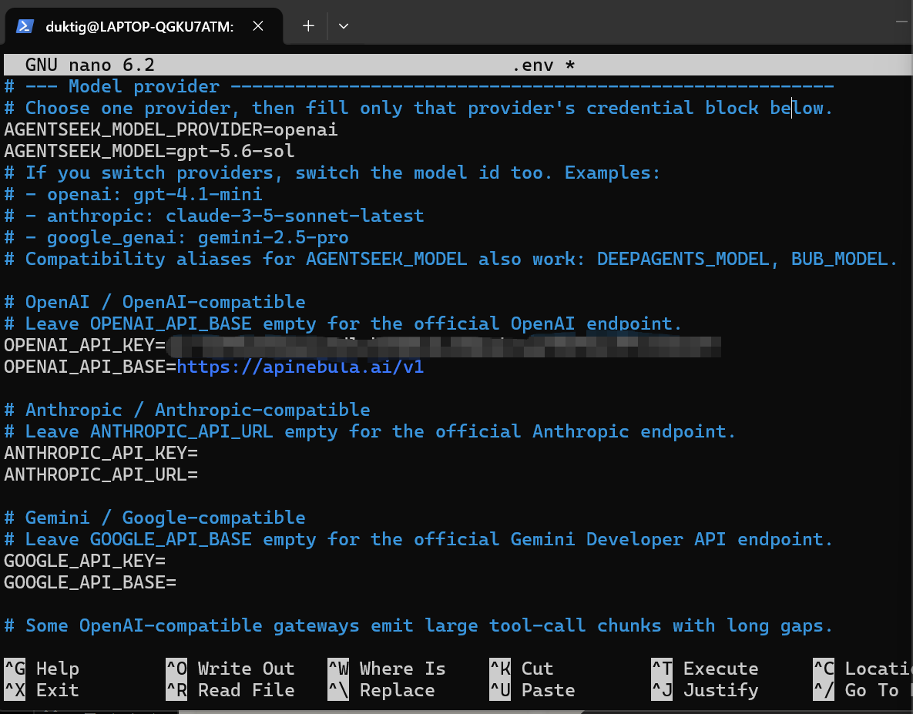

<p align="center"><strong>图3　.env 中模型与 API Base 配置（密钥已模糊）</strong></p>


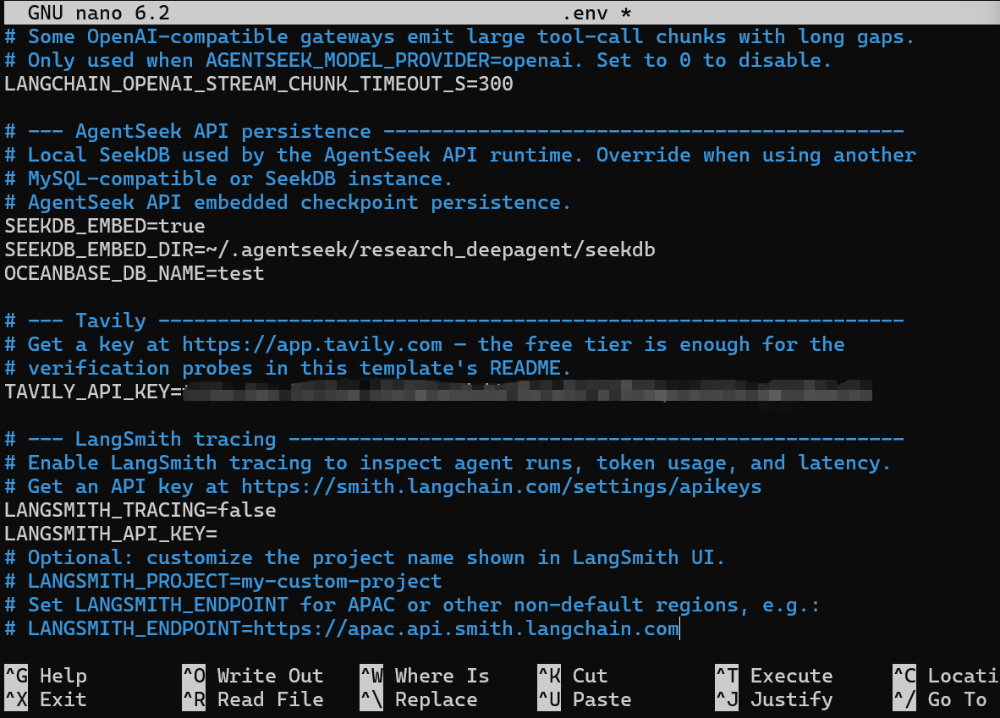

<p align="center"><strong>图4　.env 中 Tavily 与 SeekDB 默认项（密钥已模糊）</strong></p>


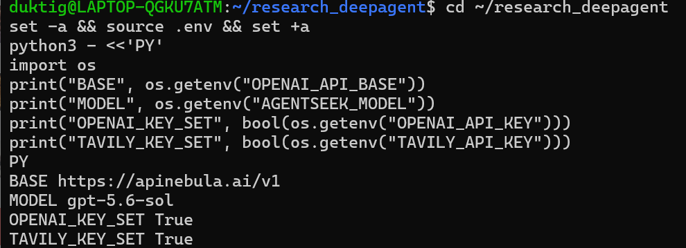

<p align="center"><strong>图5　Model API / Tavily 环境变量已加载自检</strong></p>


#### 验收

前端发起研究问题后，模型能调用工具并生成带结构的研究报告：

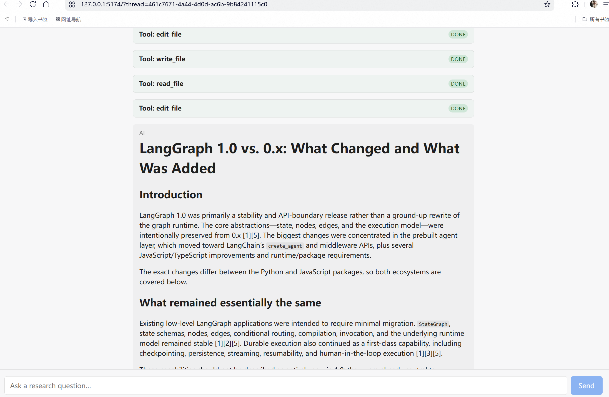

<p align="center"><strong>图6　研究 Agent 产出结构化报告（Model API 验收）</strong></p>


### 3.3 Git

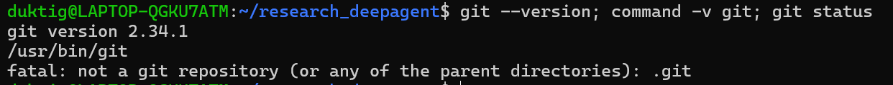

<p align="center"><strong>图7　Git 版本与路径自检</strong></p>


- `git 2.34.1`，`/usr/bin/git`（Linux 侧）。
- 目录尚未 `git init`：模板默认如此，不影响 Git 环境自检。
- 已成功：`agentseek create deepagents/research --checkout main --no-input`。

### 3.4 LangSmith

```bash
LANGSMITH_TRACING=true
LANGSMITH_API_KEY=lsv2_***（已打码）
LANGSMITH_PROJECT=deepagents-course
```

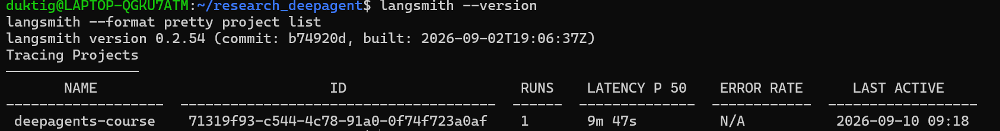

<p align="center"><strong>图8　LangSmith CLI 版本与项目列表</strong></p>


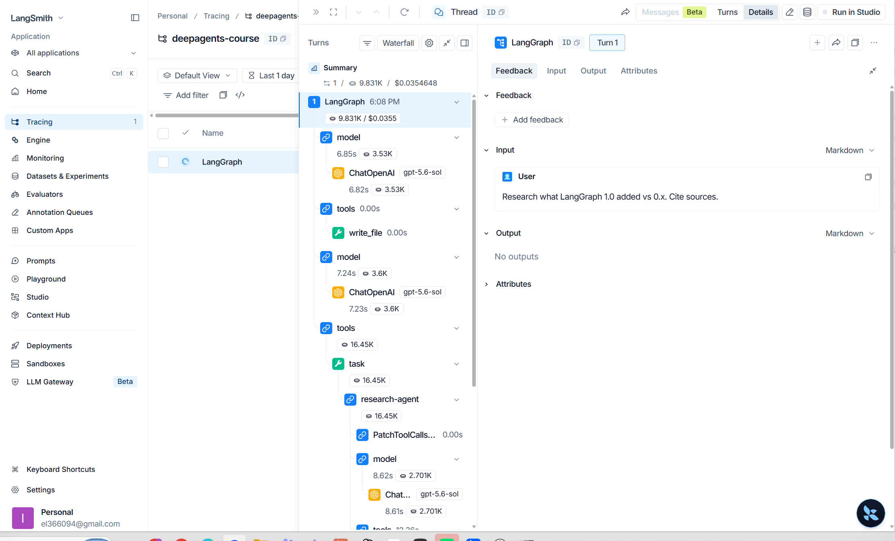

<p align="center"><strong>图9　LangSmith Trace 瀑布（deepagents-course）</strong></p>


- 列表根名显示 `LangGraph`；metadata 中 `graph_id` 仍为 `research`。
- Trace ID：`01a08a93-7fb7-7562-97aa-a16f02e061e7`。

---

## 4. 关键运行日志

### 4.1 创建模板与依赖

```text
$ agentseek create deepagents/research --checkout main --no-input
Created research_deepagent

$ agentseek task sync
Using CPython 3.12.14
Creating virtual environment at: .venv
Installed ... deepagents==0.7.13 ...
```

### 4.2 `agentseek doctor`（全绿）

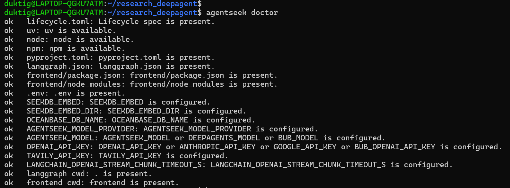

<p align="center"><strong>图10　agentseek doctor 全绿</strong></p>


### 4.3 启动：dry-run 与真正 dev

`--dry-run` 不启动服务；真正 `agentseek dev` 后前端就绪：

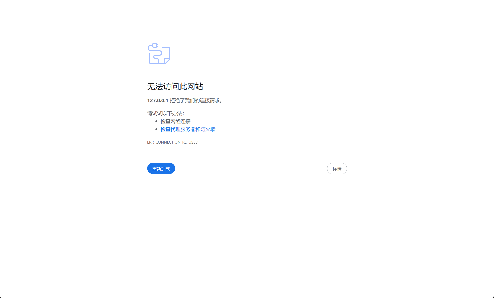

<p align="center"><strong>图11　仅 dry-run 时浏览器连接被拒绝</strong></p>


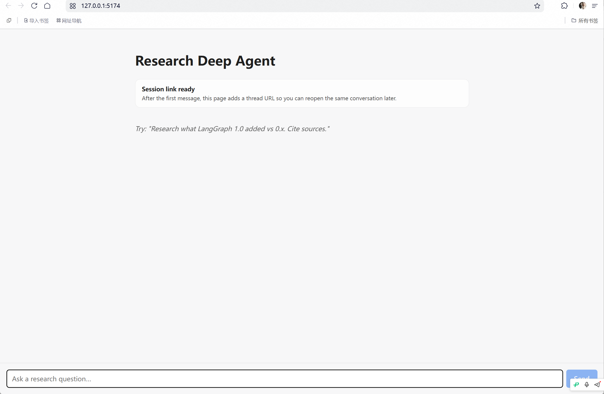

<p align="center"><strong>图12　Research Deep Agent 前端就绪</strong></p>


### 4.4 研究验证

输入：`Research what LangGraph 1.0 added vs 0.x. Cite sources.`  
产出见上文验收图。

### 4.5 LangSmith CLI 慢调用分析

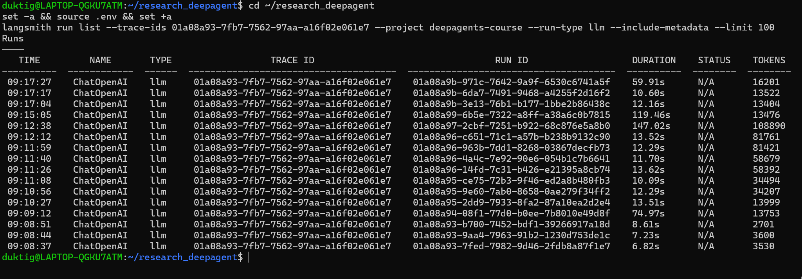

<p align="center"><strong>图13　run-type=llm 列表（最慢约 147s）</strong></p>


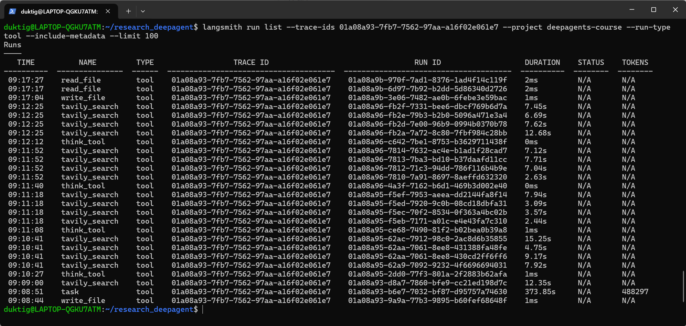

<p align="center"><strong>图14　run-type=tool 列表（task 为包装层）</strong></p>


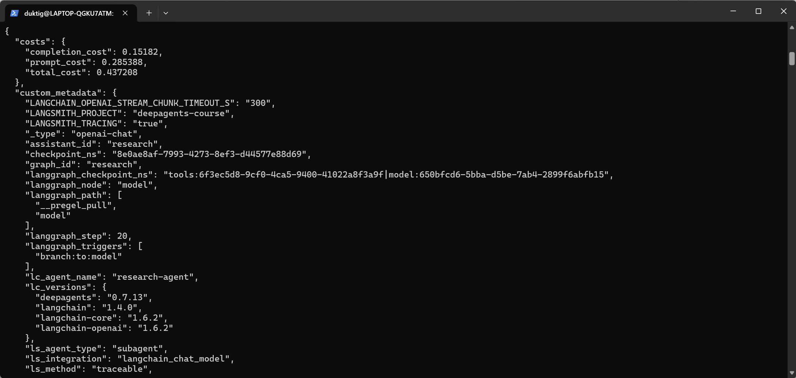

<p align="center"><strong>图15　最慢 ChatOpenAI run 元数据（research-agent）</strong></p>


| 调用 | 类型 | 耗时 |
|------|------|------|
| ChatOpenAI `01a08a97-2cbf-...` | 叶子 llm | **147.02s** |
| tavily_search `01a08a96-fb2a-...` | 真实 tool | **12.68s** |
| task / 根 Trace | 聚合层 | ~373s / ~590s（不当单次瓶颈） |

---

## 5. 准备篇（下）技能安装

项目级安装，选择 Symlink：

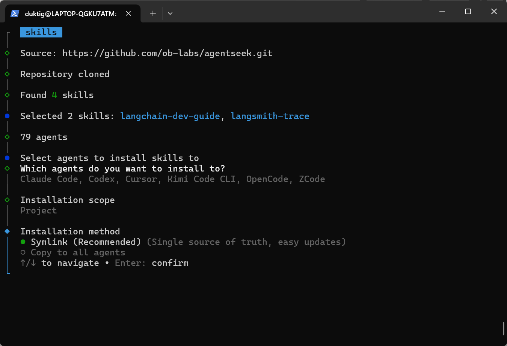

<p align="center"><strong>图16　Skills 安装方式选择 Symlink</strong></p>


已安装：`.agents/skills/langchain-dev-guide`、`langsmith-trace`（`.claude/skills/` 同步存在）。未做全局安装。

编码助手 Skill ≠ 第7章运行时 Skill。

---

## 6. 问题排查过程（按时间顺序）

每条按同一结构写：**遇到的报错（原文）→ 原因分析 → 排查/解决命令与结果**。

### 6.1 `wsl --install` 拉取发行版列表超时

**报错原文：**

```text
PS C:\WINDOWS\system32> wsl --install
无法从 'https://raw.githubusercontent.com/microsoft/WSL/master/distributions/DistributionInfo.json' 提取通讯组列表。操作超时
错误代码: Wsl/InstallDistro/WININET_E_TIMEOUT
```

**原因分析：**  
不是命令写错，是访问 `raw.githubusercontent.com` 超时（国内常见网络问题）。

**排查与结果：**

```powershell
curl.exe -I --max-time 10 https://raw.githubusercontent.com/microsoft/WSL/master/distributions/DistributionInfo.json
```

结果：返回 `HTTP/1.1 200 OK`，说明稍后网络已通，可继续装/检查 WSL。

---

### 6.2 再次 `wsl --install` 报发行版已存在

**报错原文：**

```text
PS C:\WINDOWS\system32> wsl --install
已存在具有所提供名称的分发。使用 --name 选择其他名称。
错误代码: Wsl/InstallDistro/ERROR_ALREADY_EXISTS
```

**原因分析：**  
默认 Ubuntu 已经装过，再跑 `wsl --install` 会撞名，不是安装失败。

**排查与结果：**

```powershell
wsl -l -v
```

结果：已有 `Ubuntu`（VERSION 2）和 `docker-desktop`，直接使用即可，无需重装。

---

### 6.3 自检发现 Windows 的 `npm` 混进 WSL PATH

**报错/异常原文：**

```text
npm -> /mnt/c/Program Files/nodejs/npm
  ⚠ 混用了 Windows 路径，不符合建议
python3 -> /usr/bin/python3   ✓
git -> /usr/bin/git           ✓
```

**原因分析：**  
WSL 默认继承 Windows PATH，课程要求不要混用 Windows 与 WSL 的 Node/npm。

**排查与解决：**

1. 写入配置（需 sudo）：

```bash
sudo tee /etc/wsl.conf >/dev/null <<'EOF'
[interop]
appendWindowsPath = false
EOF
```

2. 在 **Windows PowerShell**（不是 Ubuntu 里）执行：

```powershell
wsl --shutdown
wsl -d Ubuntu
```

3. 验证：

```bash
command -v npm; command -v node
echo $PATH | tr ':' '\n' | grep -E '^/mnt/c' || echo "PATH 里已无 /mnt/c（符合预期）"
```

结果：`appendWindowsPath = false` 生效，PATH 不再出现 `/mnt/c/...`。

---

### 6.4 忘记 Ubuntu sudo 密码

**报错原文：**

```text
[sudo] password for duktig:
Sorry, try again.
[sudo] password for duktig:
```

**原因分析：**  
密码遗忘，无法改 `/etc/wsl.conf`；与管理员 PowerShell 无关。

**排查与解决：**

```powershell
wsl -d Ubuntu -u root
```

```bash
passwd duktig
# 输入两遍新密码
exit
```

结果：

```text
passwd: password updated successfully
```

之后可用新密码执行 `sudo`。

---

### 6.5 在 Ubuntu 里执行了 `wsl --shutdown`

**报错原文：**

```text
duktig@LAPTOP-QGKU7ATM:/mnt/c/WINDOWS/system32$ wsl --shutdown
Command 'wsl' not found, but can be installed with:
sudo apt install wsl
```

**原因分析：**  
`wsl` 是 **Windows** 命令；人还在 Ubuntu shell 里，Linux 没有该命令（也不要 `apt install wsl`）。

**排查与解决：**

```bash
exit
```

回到 `PS C:\...>` 后再执行：

```powershell
wsl --shutdown
wsl -d Ubuntu
```

结果：WSL 正常重启，配置生效。

---

### 6.6 课程 PowerShell 装 uv 与 WSL 路线冲突（选择问题）

**现象：**  
教程写了原生 Windows：

```powershell
powershell -ExecutionPolicy ByPass -c "irm https://astral.sh/uv/install.ps1 | iex"
```

**原因分析：**  
已走 WSL2 跟课，再在 PowerShell 装 uv 会再次混用工具链。

**解决：**  
在 WSL 内安装：

```bash
curl -LsSf https://astral.sh/uv/install.sh | sh
source $HOME/.local/bin/env
uv --version
```

结果：`uv 0.12.12`（Linux 侧）。

---

### 6.7 `source` 时把说明文字一起粘贴

**报错原文：**

```text
$ source $HOME/.local/bin/env (sh, bash, zsh)
-bash: syntax error near unexpected token `('
$ uv --version
Command 'uv' not found, but can be installed with:
sudo snap install astral-uv
```

**原因分析：**  
`(sh, bash, zsh)` 是安装器说明，不是命令的一部分；PATH 未加载，所以找不到 `uv`（其实已装到 `~/.local/bin`）。

**排查与解决：**

```bash
source $HOME/.local/bin/env
uv --version
```

结果：`uv 0.12.12 (x86_64-unknown-linux-gnu)`。

---

### 6.8 前端依赖：缺少 npm → `edgesOut` 崩溃

**报错原文 1（尚无 Node）：**

```text
$ agentseek task frontend
Missing executable: npm.
Install npm and make sure it is on PATH.
```

**报错原文 2（装上 Node 后）：**

```text
$ agentseek task frontend
npm error Cannot read properties of null (reading 'edgesOut')
```

清缓存后仍失败：

```text
v22.23.2
10.9.8
npm error Cannot read properties of null (reading 'edgesOut')
```

**原因分析：**  
1. 关掉 Windows PATH 后，WSL 里本来就没有 Linux 版 npm。  
2. `edgesOut` 是 npm 解析 peer 依赖时的已知 bug，清 `node_modules` 往往不够。

**排查与解决：**

```bash
# 安装 Node 22（示例）
curl -fsSL https://deb.nodesource.com/setup_22.x | sudo -E bash -
sudo apt-get install -y nodejs

cd ~/research_deepagent
sudo npm install -g npm@12
rm -rf frontend/node_modules frontend/package-lock.json
npm install --prefix frontend --legacy-peer-deps
```

结果：

```text
12.0.2
added 216 packages, and audited 217 packages in 23s
found 0 vulnerabilities
```

---

### 6.9 浏览器打不开 `127.0.0.1:5174`

**报错原文：**  
页面提示「无法访问此网站 / 127.0.0.1 拒绝了我们的连接请求」`ERR_CONNECTION_REFUSED`（见**图11**）。

**原因分析：**  
只跑了 `agentseek dev --dry-run`，它只打印启动计划，**不会真正起服务**。

**排查与解决：**

```bash
cd ~/research_deepagent
agentseek dev
```

结果：后端 `2024`、前端 `5174` 起来后，页面显示 Research Deep Agent（见**图12**）。

---

### 6.10 LangSmith Tracing 列表为空

**现象原文：**  
LangSmith 网页提示 `No tracing projects found`：

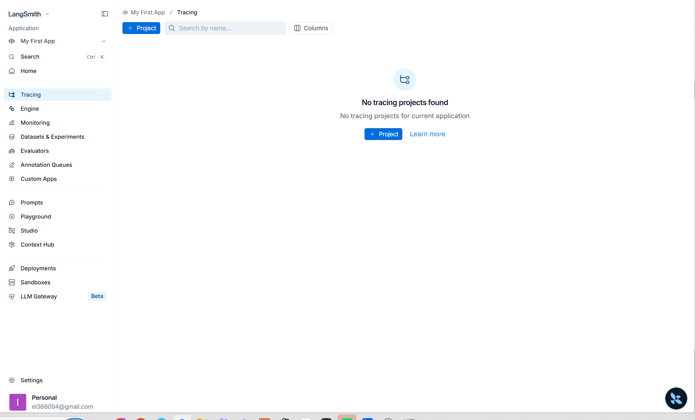

<p align="center"><strong>图17　LangSmith Tracing 暂时为空</strong></p>


**原因分析：**  
项目名 `deepagents-course` 不会预建；需 `.env` 开启 Tracing、**重启** `agentseek dev`，并实际跑完一轮对话后，Trace 才会上报。

**排查与解决：**

1. `.env` 确认：

```bash
LANGSMITH_TRACING=true
LANGSMITH_API_KEY=...
LANGSMITH_PROJECT=deepagents-course
```

2. `Ctrl+C` 停掉旧进程后重新 `agentseek dev`，再发研究问题。

结果：项目 `deepagents-course` 出现 Trace；CLI：

```bash
set -a && source .env && set +a
langsmith --format pretty project list
```

可见 1 条运行（约 9m47s）。

---

### 6.11 Codex 说没有 `langsmith-trace`

**现象原文：**  
Codex 回复当前环境未发现 `langsmith-trace` 命令/Skill：

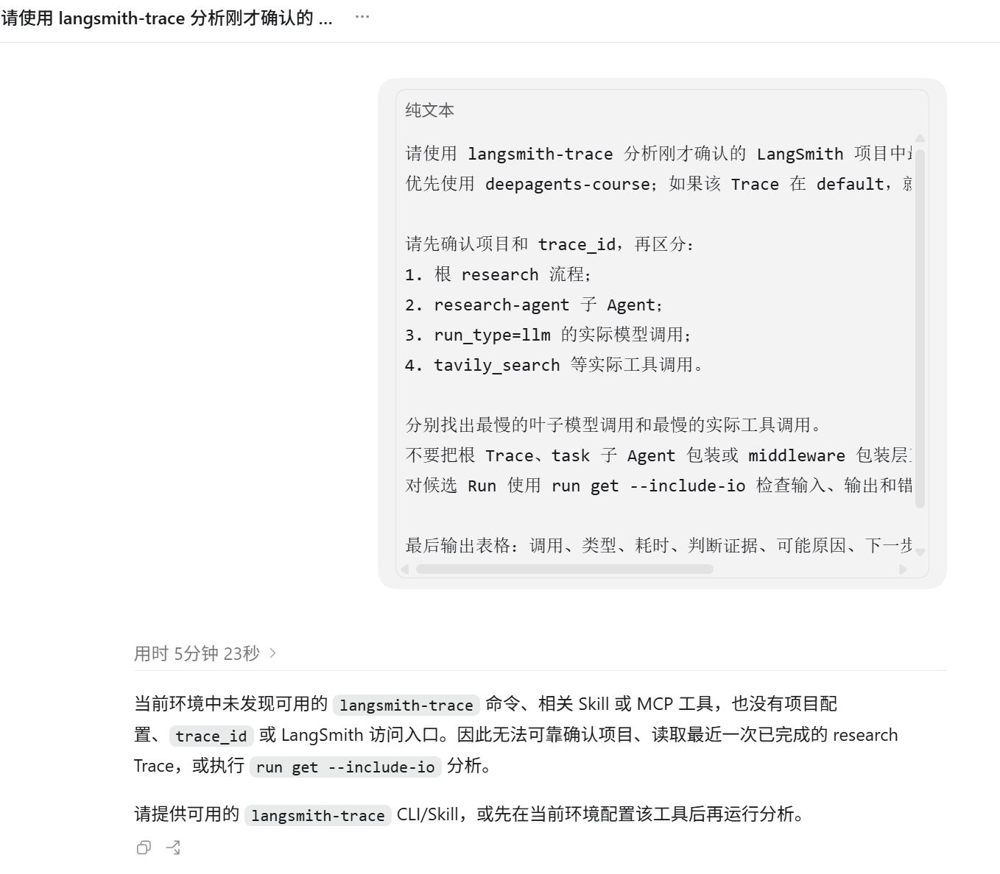

<p align="center"><strong>图18　Codex 反馈找不到 langsmith-trace</strong></p>


**原因分析：**  
Skill 已装在项目 `~/research_deepagent/.agents/skills/`（项目级）；Codex 若工作区不在该目录，或把 Skill 当成系统命令找，就会“找不到”。

**排查与解决：**

- Windows 打开工作区：`\\wsl$\Ubuntu\home\duktig\research_deepagent`
- 同时用 WSL CLI 自己分析 Trace（不依赖 Codex）

结果：CLI 可列出 llm/tool runs；Codex 在正确工作区后也可对照分析。

---

### 6.12 `langsmith trace list --name` 返回 400

**报错原文：**

```text
$ langsmith trace list --project deepagents-course --name LangGraph --include-metadata --limit 5
querying runs (v2): POST "https://api.smith.langchain.com/api/v2/runs/query": 400 Bad Request
..."search" requires 1 arguments, got 2...
```

对 `--name research` 同样 400。

**原因分析：**  
本机 LangSmith CLI 0.2.54 对 `--name` 过滤拼查询有 bug；与项目是否为空无关。教程根名 `research` 与列表显示名 `LangGraph` 也不一致，不必强行 `--name`。

**排查与解决：**

```bash
langsmith trace list --project deepagents-course --limit 5
```

结果：

```text
09:08:37  LangGraph  chain  TRACE 01a08a93-7fb7-7562-97aa-a16f02e061e7
```

后续：

```bash
langsmith run list --trace-ids 01a08a93-7fb7-7562-97aa-a16f02e061e7 --project deepagents-course --run-type llm --limit 100
langsmith run list --trace-ids 01a08a93-7fb7-7562-97aa-a16f02e061e7 --project deepagents-course --run-type tool --limit 100
```

定位最慢叶子模型约 147s、最慢真实工具 `tavily_search` 约 12.68s。

---

## 7. 收获与下一步

1. WSL2 + 不混用工具链更重要。  
2. `doctor` / Trace / CLI 可复用。  
3. 下一步：**任务2（认知篇第1–2章）**，不必先跳第7章。

## 附录

- 课程：https://datawhalechina.github.io/deepagents-in-action/  
- 项目：`/home/duktig/research_deepagent`  
- LangSmith：`deepagents-course` · Trace `01a08a93-7fb7-7562-97aa-a16f02e061e7`
