# 任务2：第2章快速上手 — 学习笔记

> 课程：[Deep Agents 实战 · 第2章](https://datawhalechina.github.io/deepagents-in-action/chapters/ch02-quickstart/)  
> 环境：WSL2 Ubuntu · deepagents 0.7.13 · 硅基流动 SiliconFlow  
> 项目路径：`~/projects/deepagents-in-action/ch02-quickstart`

---

## 1. 本章在解决什么

第1章讲清了 Runtime / Framework / Harness 三层；第2章用最短路径亲手跑通三类 Agent：

1. **Hello World**：一个工具 + `create_deep_agent` + `invoke`
2. **计算器助手**：多工具串联（数学 + 货币换算）
3. **研究助手**：Tavily 联网搜索 + TodoList 中间件 + LangSmith Trace

目标不是堆代码，而是验证：**自定义工具怎么注册、模型怎么换、Trace 里怎么看调用链**。

---

## 2. 环境核对（接续任务1）

### 2.1 Python 版本

```bash
python3 --version
# 要求 3.11+；本机为 3.12.x（符合）
```

### 2.2 新建实验目录并装依赖

任务1 的 `research_deepagent` 是 AgentSeek 模板；本章用独立小项目练手：

```bash
mkdir -p ~/projects/deepagents-in-action/ch02-quickstart
cd ~/projects/deepagents-in-action/ch02-quickstart
source $HOME/.local/bin/env   # 确保 uv 在 PATH
uv init --name ch02-quickstart
uv add deepagents langchain-openai
```

- `deepagents`：Harness（`create_deep_agent`）
- `langchain-openai`：用 OpenAI 兼容协议接硅基流动 / 中转站

> 注意：`source $HOME/.local/bin/env`，不要写成 `source $/HOME/...`（多一个 `$` 会失效）。

### 2.3 硅基流动 API Key 与模型

本章实验优先用硅基流动免费/券覆盖模型，避免和任务1 的 APINebula GPT 混用：

```bash
# ~/.env 或项目 .env（勿提交 Git）
export SILICONFLOW_API_KEY="sk-..."
export MODEL_NAME="Qwen/Qwen2.5-7B-Instruct"
export TAVILY_API_KEY="tvly-..."   # 研究助手需要
```

加载方式：

```bash
set -a && source ~/.env && set +a
# 或
export $(grep -v '^#' ~/.env | xargs)
```

**免费模型识别**：模型广场里标 Free / 价格为 0 的即可，例如 `Qwen/Qwen2.5-7B-Instruct`。  
代金券要看「适用模型」列表；余额为负且无透支时，付费模型会 402。

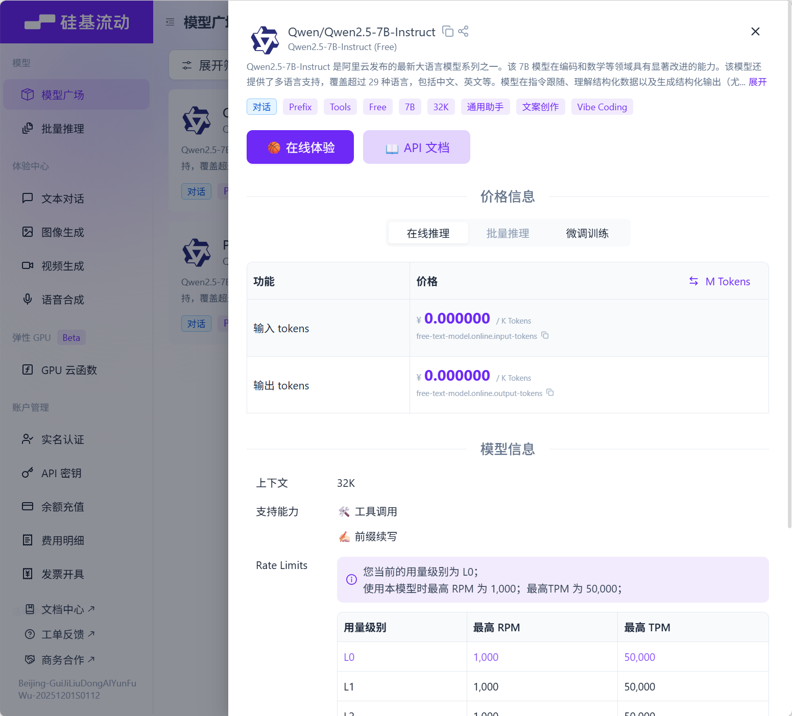

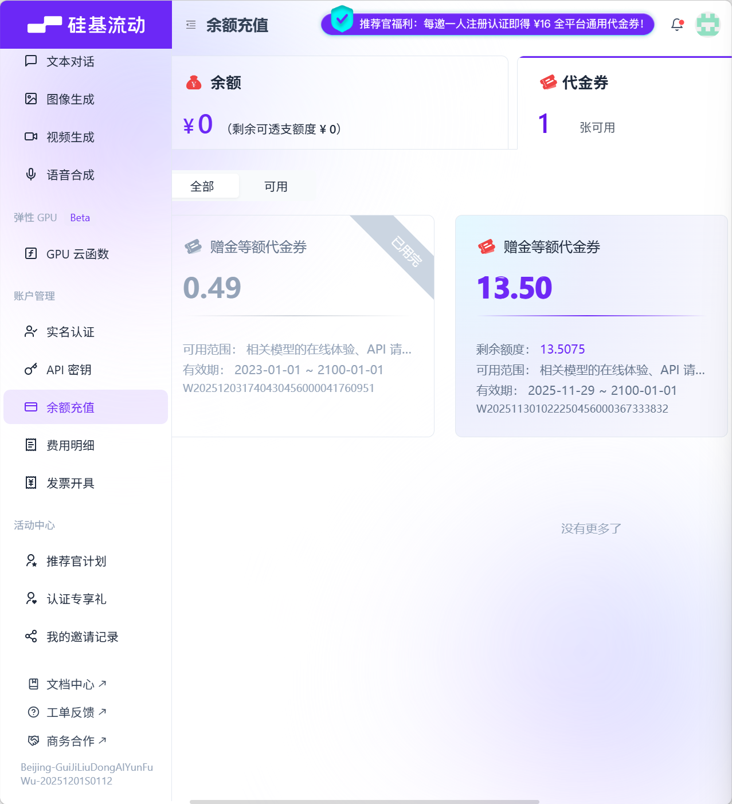

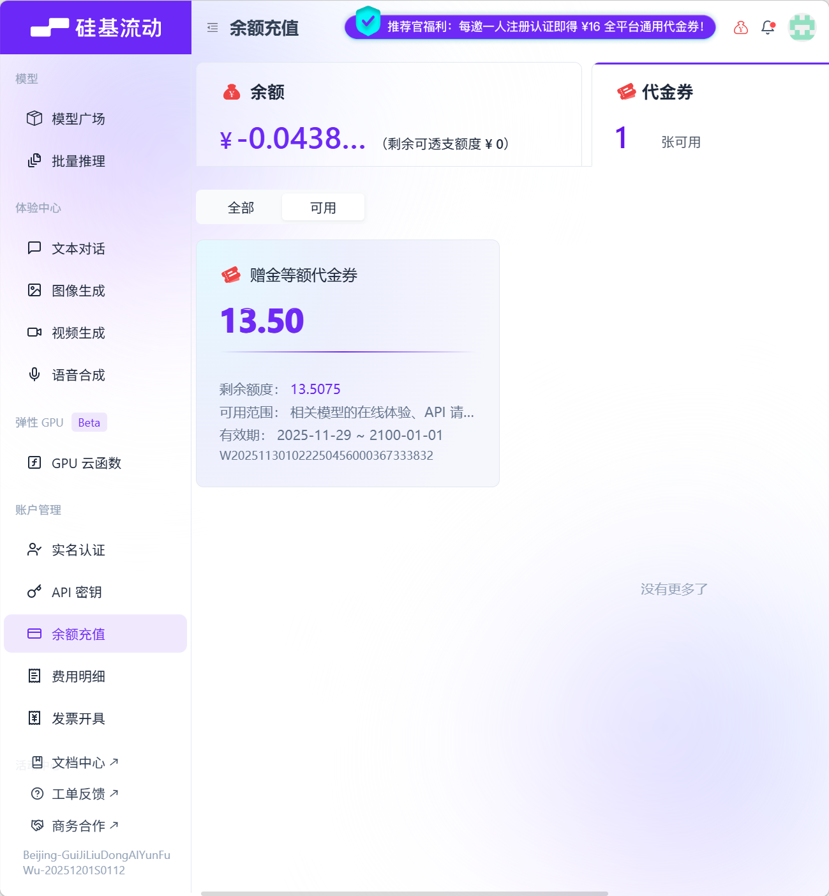

---

## 3. 实验一：Hello World Agent

### 3.1 代码要点（`hello_agent.py`）

```python
import os
from langchain_openai import ChatOpenAI
from deepagents import create_deep_agent

model = ChatOpenAI(
    model=os.environ.get("MODEL_NAME", "Qwen/Qwen2.5-7B-Instruct"),
    api_key=os.environ["SILICONFLOW_API_KEY"],
    base_url="https://api.siliconflow.cn/v1",
)

def get_weather(city: str) -> str:
    """Get weather for a given city."""
    print("工具被调用了，city=", city)  # 调试：确认是否真调用了工具
    return f"It's always sunny in {city}!"

agent = create_deep_agent(
    model=model,
    tools=[get_weather],
    system_prompt="You are a helpful assistant.",
)

result = agent.invoke(
    {"messages": [{"role": "user", "content": "北京今天天气怎么样？"}]}
)
print(result["messages"][-1].content)
```

运行：

```bash
uv run python hello_agent.py
```

### 3.2 结果与对照

- **有工具**：终端先打印 `工具被调用了，city= 北京`，再输出 sunny 类回复 → 说明走了工具，不是纯幻觉天气。
- **无工具对照**（`hello_no_tool.py`，`tools=[]`）：模型用常识回答，不会出现调试 print。

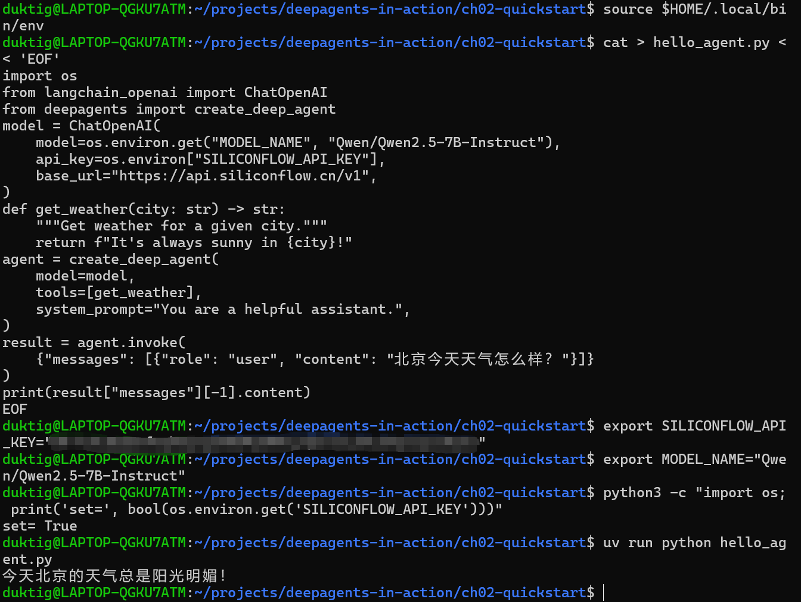

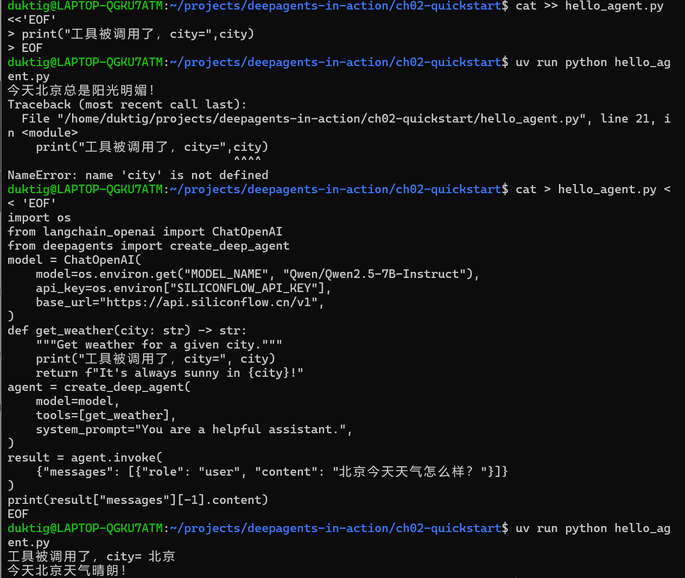

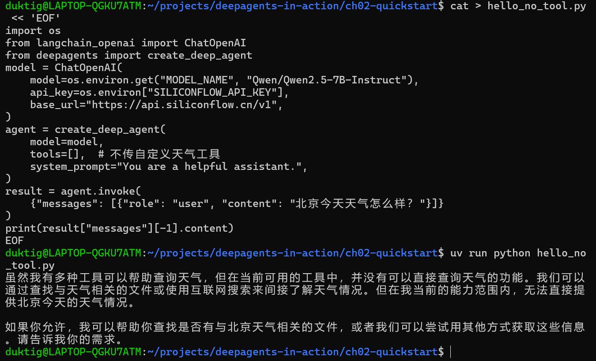

### 3.3 踩坑：调试输出放错位置

一开始把 `print` 写在脚本**最后面**（最终输出附近），只能看到整次运行结束时的结果，**不能证明工具函数在 Agent 循环里被调用过**。

正确做法：把调试 `print` 放进工具函数内部，例如：

```python
def get_weather(city: str) -> str:
    print("工具被调用了，city=", city)
    return f"It's always sunny in {city}!"
```

这样终端先出现调试行，再出现最终回复，才能确认走了工具而不是纯模型常识。

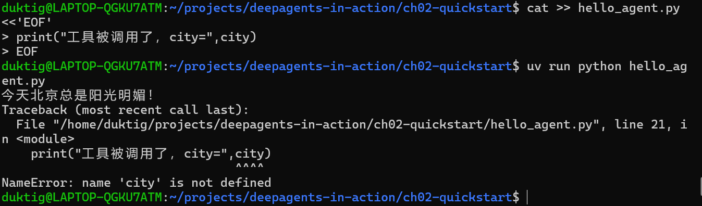

**结论**：自定义工具 = 普通 Python 函数 + 类型注解 + docstring；注册进 `tools=` 后由模型决定是否调用。

---

## 4. 实验二：计算器 + 货币换算

### 4.1 代码要点（`calc_agent.py`）

两个工具：`calculate(expression)`、`convert_currency(amount, from_currency, to_currency="CNY")`。

要点：

- docstring / `Args` 帮助模型理解参数
- `to_currency` 有默认值
- `calculate` 演示用了 `eval`（生产环境不要对用户输入直接 eval）

提问示例：

> 帮我把 100 美元换算成人民币，再用它乘以 1.08 的通胀系数。

### 4.2 小模型 vs 更强模型

| 模型 | 现象 |
|------|------|
| `Qwen/Qwen2.5-7B-Instruct` | 可能第二次 `calculate` 写成 `eval("result * 1.08")`，把中间变量当表达式 → 结果错 |
| `zai-org/GLM-4.5-Air`（券可用） | 能正确串联：先换算再乘 1.08 |

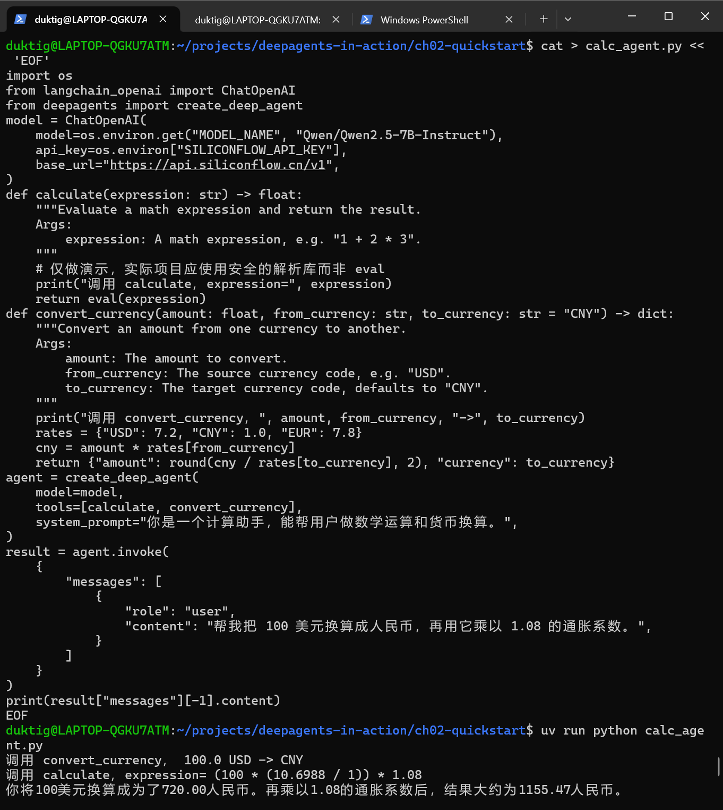

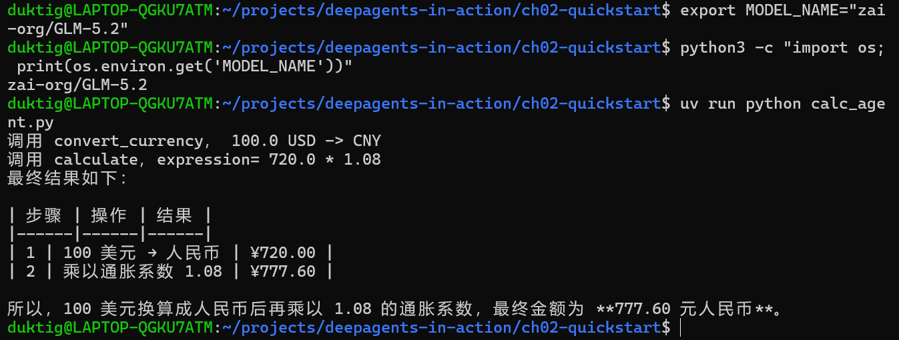

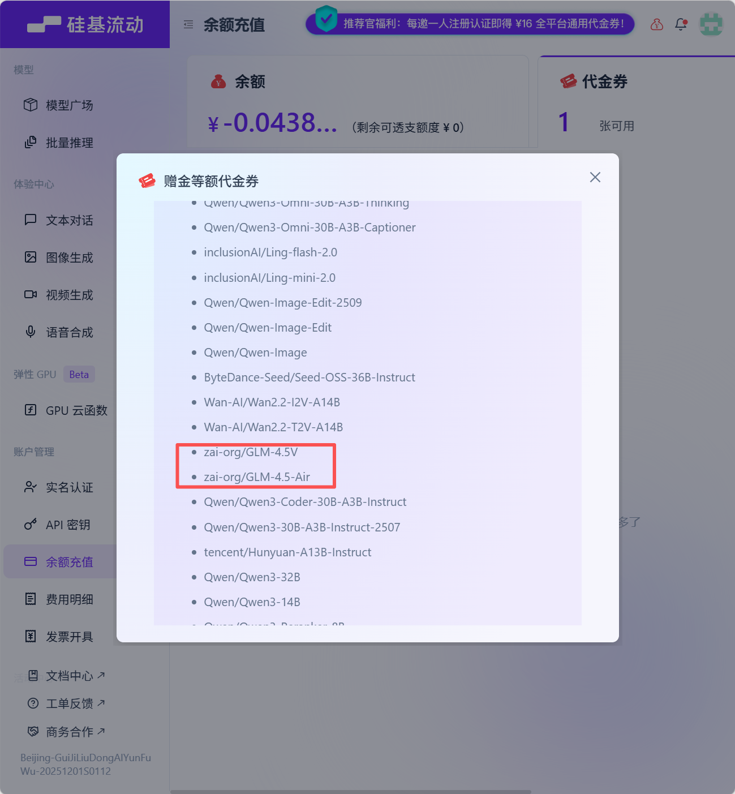

**换模型方式**（任选其一）：

```bash
export MODEL_NAME="zai-org/GLM-4.5-Air"
# 或改脚本里 ChatOpenAI(model=...)
```

**结论**：工具链「能不能对」取决于模型推理质量；小模型适合验证工具能调通，复杂串联应用更强模型或把中间结果写进工具返回值里强制传参。

---

## 5. 实验三：研究助手 + Tavily + TodoList

### 5.1 与任务1 模板的关系

- 任务1：`agentseek create deepagents/research` → `~/research_deepagent`（前后端完整模板）
- 本章：独立脚本 `research_agent.py`，只练 `create_deep_agent` + 搜索工具

不必把 `research_deepagent` 挪进 `ch02`；保留在家目录即可，笔记/产出统一放 `deepagents-in-action`。

### 5.2 为何又 `export MODEL_NAME`

任务1 `.env` 可能是 APINebula 的 GPT；本章脚本读的是 `SILICONFLOW_API_KEY` + `MODEL_NAME`。  
当前 shell 里再 `export MODEL_NAME=...` 是为了**覆盖当次会话**，避免混用额度/账号。

付费模型（如 `GLM-5.2`）在余额不足时会：

```text
Error code: 402 - account balance is insufficient
```

改回免费或券覆盖模型即可。

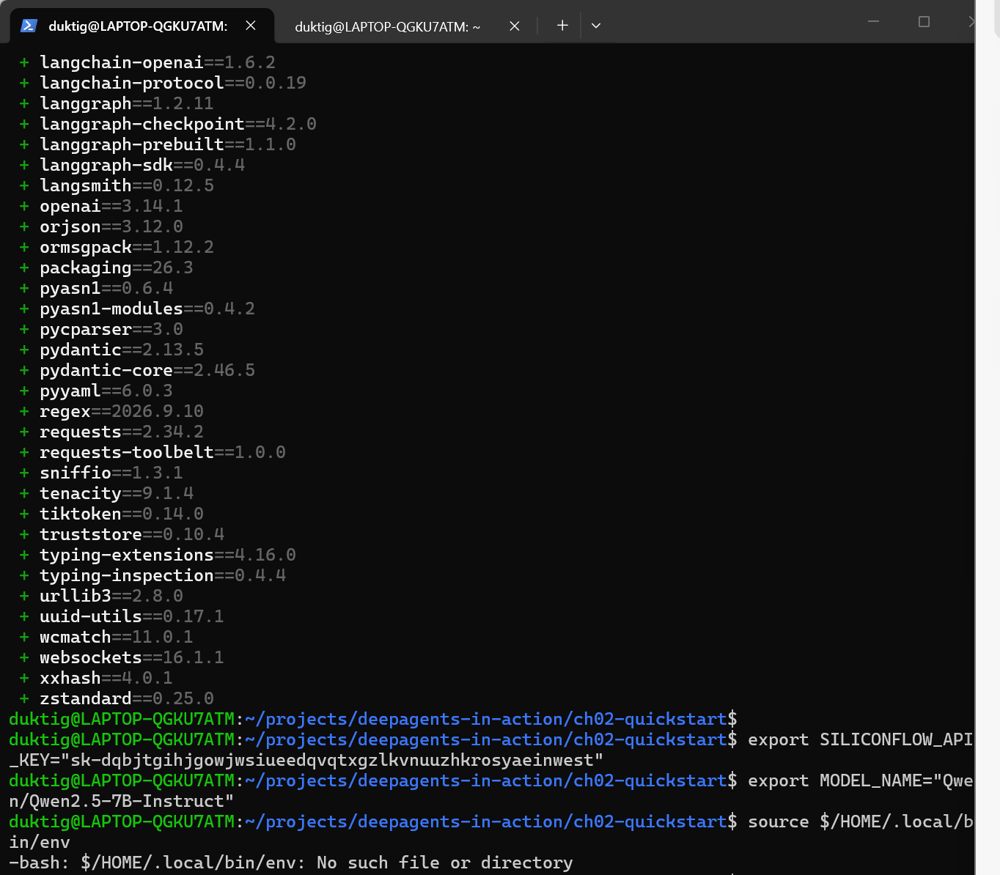

### 5.3 代码要点（`research_agent.py`）

```python
from typing import Literal
from langchain.agents.middleware import TodoListMiddleware
from tavily import TavilyClient
# ... model 配置同前

def internet_search(
    query: str,
    max_results: int = 5,
    topic: Literal["general", "news", "finance"] = "general",
    include_raw_content: bool = False,
):
    """Run a web search for the given query."""
    print("调用 internet_search，query=", query)
    return tavily_client.search(...)

agent = create_deep_agent(
    model=model,
    tools=[internet_search],
    system_prompt=research_instructions,
    middleware=[TodoListMiddleware()],  # v0.7 起需显式打开
)
```

- `Literal[...]`：限制 `topic` 只能取给定字符串
- `TodoListMiddleware`：显式打开任务清单能力（v0.7 Harness 不再默认全开）

运行后应看到多次 `internet_search` 打印，并输出结构化研究报告。

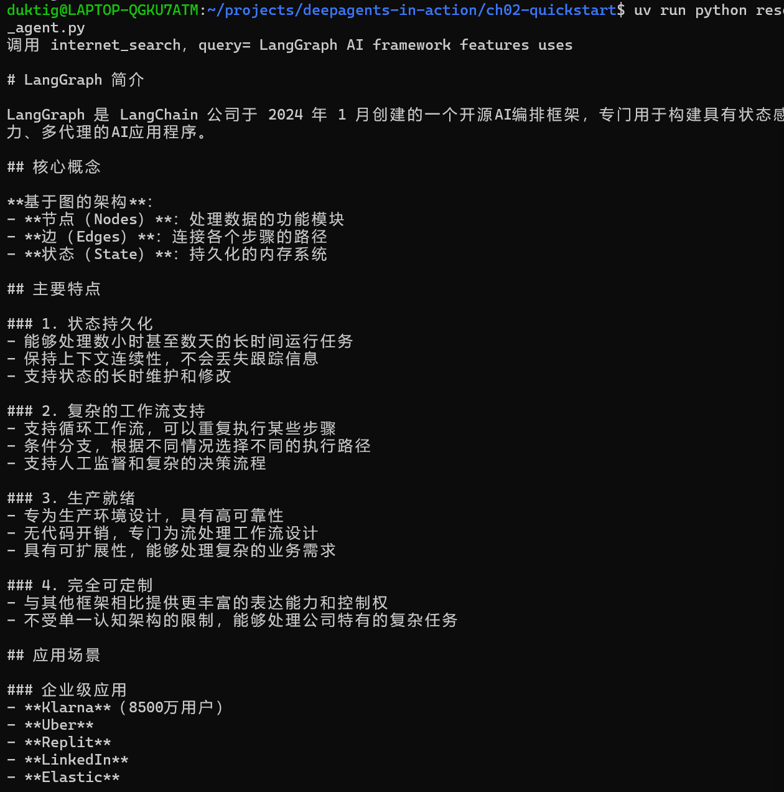

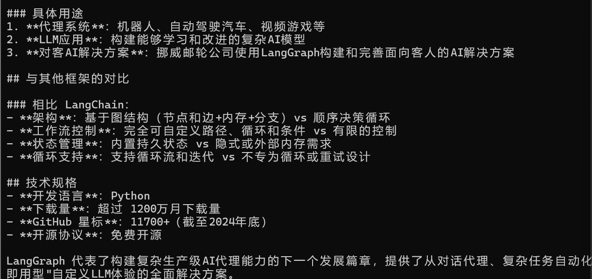

### 5.4 LangSmith Trace 怎么看

确保环境变量：

```bash
LANGSMITH_TRACING=true
LANGSMITH_API_KEY=...
LANGSMITH_PROJECT=deepagents-course   # 或自建项目名
```

看瀑布图时关注：

- 根节点多为 `LangGraph` / Agent 聚合耗时
- **叶子 LLM**、**叶子 tool** 才是真实瓶颈
- Attributes 里可核对 model、tool 入参出参、error

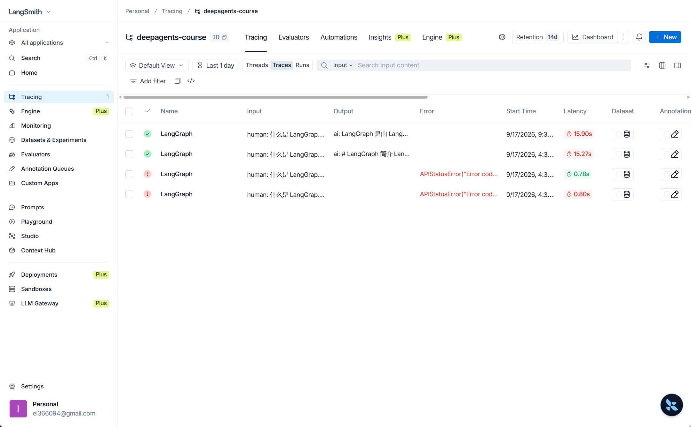

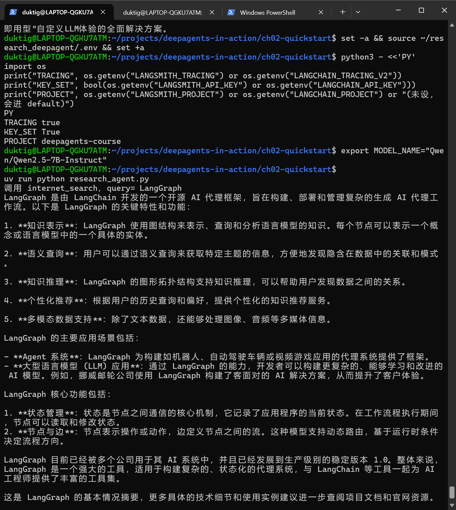

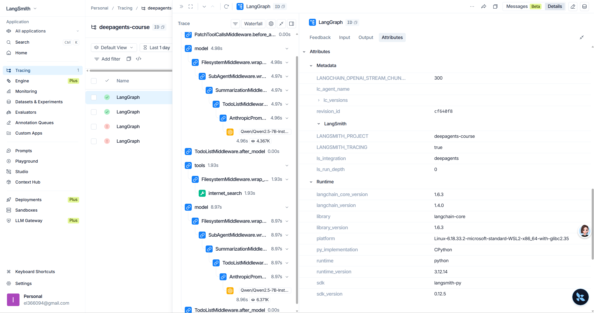

（准备篇已分析过的 Trace `01a08a93-...`：最慢叶子 LLM ~147s，`tavily_search` ~12.68s，可作对照。）

---

## 6. 问题排查（按时间顺序）

### 6.1 `source $/HOME/.local/bin/env` 无效

- **报错/现象**：`uv` 仍 not found，或 source 无效果  
- **原因**：路径写成了 `$/HOME`（多 `$`），正确是 `$HOME`  
- **处理**：`source $HOME/.local/bin/env`，再 `uv --version`

### 6.2 `SILICONFLOW_API_KEY` / Key 未设置

- **现象**：`KeyError` 或认证失败（见图11）  
- **原因**：新开终端未 `source .env`，或变量名与脚本不一致  
- **处理**：`set -a && source ~/.env && set +a`，用 `echo ${SILICONFLOW_API_KEY:0:8}` 确认已加载（勿整段打印）

### 6.3 调试 print 放在脚本末尾，看不出工具是否被调用

- **现象**：见图7；想确认 `get_weather` 有没有被调用，但调试输出位置不对  
- **原因**：`print` 一开始写在代码**最后面**（整文件末尾），不在工具函数里；Agent 调工具时不会执行那段输出，容易误判  
- **处理**：把 `print("工具被调用了，city=", city)` **挪进工具函数内部**，再跑一遍；终端应先打调试行，再打最终回复

### 6.4 计算器串联结果错误（小模型）

- **现象**：见图8；第二次计算吃了字面量 `result`  
- **原因**：弱模型未把上一工具数值正确填进下一参数  
- **处理**：换 `GLM-4.5-Air` 等更强/券可用模型；或工具返回结构化中间结果并在 prompt 强调「只用数字」

### 6.5 `402 account balance is insufficient`

- **现象**：跑研究助手时 API 402；账户余额为负（见图3）  
- **原因**：选用了付费模型且无透支  
- **处理**：`export MODEL_NAME="Qwen/Qwen2.5-7B-Instruct"` 或券列表内模型；或充值

### 6.6 `eval` 安全提醒（非报错，属认知）

- 课内演示可用；真实产品应对用户输入用安全表达式解析库，禁止任意 `eval`

---

## 7. 概念速记（本章相关问答）

| 问题 | 一句话答案 |
|------|------------|
| 自定义工具是什么 | 自己写的 Python 函数，经 `tools=[...]` 注册 |
| `uv add` vs `pip install` | 本课用 uv 管依赖；`uv add` 写入项目并装包 |
| deepagents / langchain-openai 各干什么 | Harness 组装 Agent；后者提供 ChatOpenAI 兼容客户端 |
| 为何显式 `TodoListMiddleware` | v0.7 起策略/中间件不默认全开，按需挂载 |
| 任务1 模板要不要放进 ch02 | 不必；ch02 用独立脚本即可 |
| 研究助手为何再设 MODEL_NAME | 与任务1 中转站 GPT 隔离，当次会话覆盖模型 |

---

## 8. 交付物清单

- [x] `hello_agent.py` / `hello_no_tool.py`：有无工具对照  
- [x] `calc_agent.py`：多工具 + 换模型对比  
- [x] `research_agent.py`：Tavily + TodoList  
- [x] LangSmith 可见对应 Trace（瀑布图 / Attributes）  
- [x] 本笔记 + `assets/` 过程截图  

代码与笔记建议统一放在：

`~/projects/deepagents-in-action/ch02-quickstart/`  
（Windows 侧可经 `\\wsl$\Ubuntu\home\duktig\projects\...` 打开；知识库镜像目录可另存一份。）

---

## 9. 实验总结

本章用三个递进脚本跑通了 Deep Agents 最小闭环：注册自定义工具、多工具串联、联网研究与 Trace 观测。实践里最大收获是——**工具「能调通」和「调对」是两件事**：小模型足以验证注册与调用，复杂参数传递更依赖模型质量或结构化返回值；v0.7 下 TodoList 等能力需显式挂载；密钥与模型要用环境变量按会话隔离，避免任务1 中转站与硅基流动额度混用。下一步按组队学进度进入认知篇后续章。
